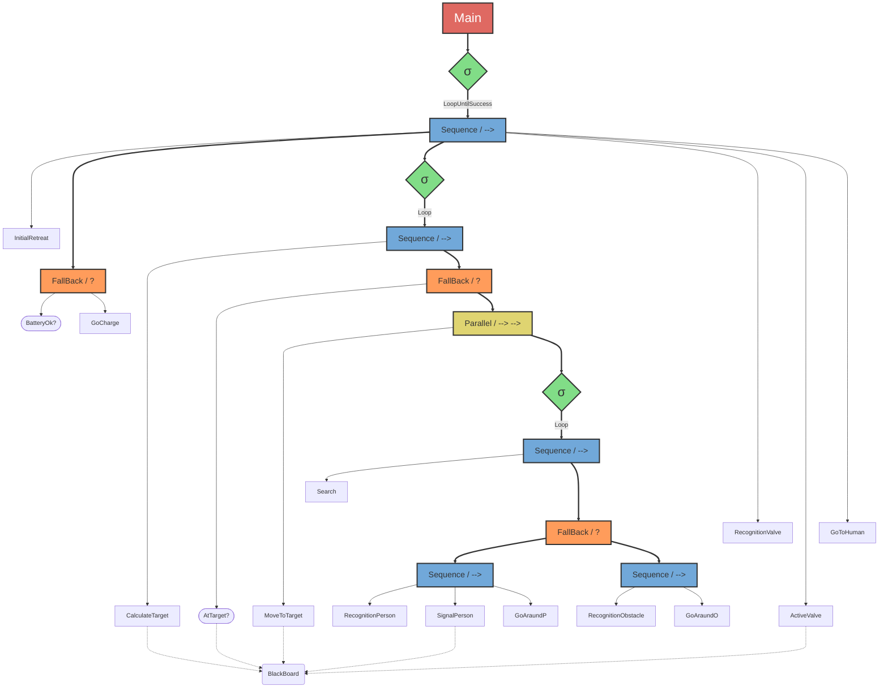

```mermaid


flowchart TD
    Root[Main] ==> Decorator0{σ}
    Decorator0 ==LoopUntilSuccess==> Sequence0
    Sequence0 ---> InitialRetreat[InitialRetreat]
    Sequence0[Sequence / -->] ====> FallBack0[FallBack / ?]
    FallBack0 --> ConditionBatt([BatteryOk?])
    FallBack0 --> ActionBatt[GoCharge]

    Sequence0 ==> Decorator2{σ}
    Decorator2 ==Loop==> Sequence4[Sequence / -->]
    Sequence4 --> CalculateTarget[CalculateTarget]
    CalculateTarget -..-> BlackBoard(BlackBoard)
    Sequence4 ==> FallBack1[FallBack / ?]
    FallBack1 --> InPosizione([AtTarget?])
    InPosizione -..-> BlackBoard
    FallBack1 ==> Parallel0[Parallel / --> -->]
    Parallel0 --> RaggiungiTarget[MoveToTarget]
    RaggiungiTarget -..-> BlackBoard
    Parallel0 ===> Decorator1{σ}
    Decorator1 ==Loop==> Sequence1[Sequence / -->]
    Sequence1 --> Search[Search]
    Sequence1 ===> FallBack2[FallBack / ?]
    FallBack2 ==>Sequence2[Sequence / -->]
    FallBack2 ==>Sequence3[Sequence / -->]
    Sequence2 --> RecognitionAction[RecognitionPerson]
    Sequence2 --> SignalAction[SignalPerson]
    SignalAction -..-> BlackBoard
    Sequence2 --> GoAraund[GoAraundP]
    Sequence3 --> RecognitionAction2[RecognitionObstacle]
    Sequence3 --> GoAraund2[GoAraundO]

     
    Sequence0 ----------> RecognitionAction3[RecognitionValve]
    Sequence0 ------> ActiveValve[ActiveValve]
    Sequence0 ----------> GoToHuman[GoToHuman]
    ActiveValve -..-> BlackBoard
    
    
    
    


style Root fill:#DF6962,stroke:#333,stroke-width:3px, font-size:25pt, color:#fff;


style Decorator0  fill:#81DD87,stroke:#333,stroke-width:3px, font-size:25pt;
style Decorator1  fill:#81DD87,stroke:#333,stroke-width:3px, font-size:25pt;
style Decorator2  fill:#81DD87,stroke:#333,stroke-width:3px, font-size:25pt;

style Parallel0  fill:#DFD471,stroke:#333,stroke-width:3px, font-size:16pt;
style Sequence0  fill:#71A8D9,stroke:#333,stroke-width:3px, font-size:16pt;
style Sequence1  fill:#71A8D9,stroke:#333,stroke-width:3px, font-size:16pt;
style Sequence2  fill:#71A8D9,stroke:#333,stroke-width:3px, font-size:16pt;
style Sequence3  fill:#71A8D9,stroke:#333,stroke-width:3px, font-size:16pt;
style Sequence4  fill:#71A8D9,stroke:#333,stroke-width:3px, font-size:16pt;


style FallBack0 fill:#FF9C5B,stroke:#333,stroke-width:3px, font-size:16pt;
style FallBack1 fill:#FF9C5B,stroke:#333,stroke-width:3px, font-size:16pt;
style FallBack2 fill:#FF9C5B,stroke:#333,stroke-width:3px, font-size:16pt;


```