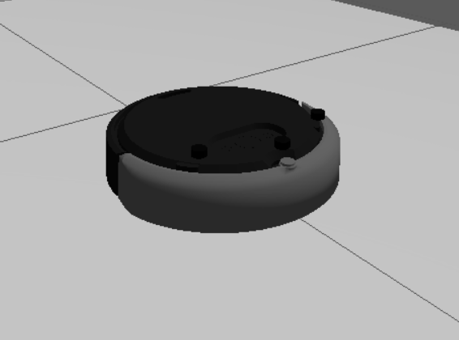
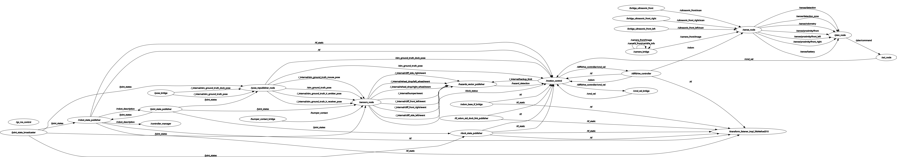
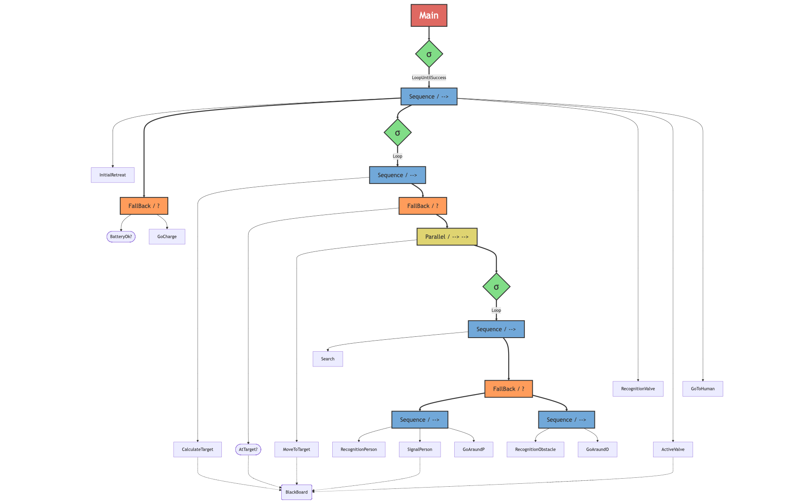

Design Document – ISRLAB Virtual Robotics Project

# 1. General Project Description

This project introduces Charlie, an autonomous mobile robot designed to operate inside hazardous indoor environments affected by accidental toxic substance release. The scenario simulates a chemical laboratory where a contaminant leak has compromised air quality and visibility, making human intervention dangerous. 

Charlie’s primary mission is to reach and simulate the activation of the emergency ventilation system (represented with a red target), located in one of several possible locations inside the building. To accomplish this, the robot autonomously explores the environment, navigates toward predefined candidate points, and reacts to unexpected obstacles along the way.

During its mission, Charlie identifies chemical debris, laboratory containers, and potential victims, using onboard perception based on object detection. The robot reports detected victims to rescue teams and ignores or bypasses non-hazardous obstacles. Its operation enhances safety by avoiding the need for personnel to enter contaminated zones.

# 2. Simulated Robot model technical description

## 2.1 Robot Model

The robotic platform selected for this simulated mission is the **iRobot Create 3**, a widely standardized mobile robot in academic research for autonomous navigation. This platform is characterized by a **differential drive kinematics configuration**, which imposes non-holonomic constraints on the robot's motion—specifically, the inability to move instantaneously in the lateral direction. Despite this constraint, the differential drive system allows for a **zero turning radius**, granting the robot exceptional maneuverability in tight, clutter-filled environments such as the simulated hazardous laboratory. The robot features a compact, circular footprint with compact dimensions, ensuring minimal inertial impact during dynamic maneuvers. Its native integration with **ROS 2** (Robot Operating System) provides a robust middleware layer for high-level control, facilitating the implementation of complex navigation and perception stacks.

The simulation model is based on the official **`irobot_create3_sim`** library, developed and maintained by iRobot. This open-source package provides the complete robot description (URDF/SDF), Gazebo plugins, and ROS 2 interfaces required for accurate simulation. The library includes pre-configured sensor models (bumpers, cliff sensors, wheel encoders, IMU) and actuator interfaces, ensuring high fidelity between the simulated behavior and the physical Create 3 hardware.

## 2.2 Sensors Set

The robot's perception system is architected around a multi-modal sensor suite, categorized into **Environmental** and **Internal** sensory channels to ensure robust environmental awareness and precise state estimation.

### Environmental Perception (External Sensing)
Primary semantic understanding is driven by a front-facing **RGB Camera**, which feeds visual data into a **YOLO-based neural network** for the detection of critical entities such as victims and hazard source control mechanisms. Complementing the visual system is an array of **three ultrasonic sensors** (front, front-left, front-right). This configuration enables a multi-layered obstacle avoidance strategy, providing mid-range spatial awareness for maneuvering and wall-following behaviors.


### Internal State Monitoring (Proprioception)
For localization and odometry, the platform relies on an **Inertial Measurement Unit (IMU)** and high-resolution **wheel encoders**. The fusion of inertial data (linear acceleration and angular velocity) with wheel odometry allows for accurate dead-reckoning navigation, which is indispensable for maintaining an estimate of the robot's pose map-frame.

## 2.3 Actuators Set

Actuation is governed by two independent DC motors driving the main wheels, implementing a classic differential drive topology. Control is achieved by varying the velocity difference between the left and right wheels; synchronous rotation produces linear motion, while opposing rotation generates in-place angular displacement. This kinematic arrangement is particularly advantageous for the project's operational domain, allowing the agent to perform re-orientation maneuvers without translational displacement—a critical capability when navigating narrow corridors obstructed by debris.

## 2.4 Body Shape



The morphological design of the robot features a **cylindrical chassis** with a low vertical profile. This axially symmetric shape offers significant algorithmic advantages for path planning and collision checking. Since the robot's collision footprint is invariant under rotation, the motion planner can treat the robot as a simple circle in the configuration space, drastically simplifying the computational complexity of obstacle avoidance and path generation. Furthermore, the absence of protruding corners significantly reduces the risk of entanglement with environmental clutter, enhancing the robust execution of autonomous exploration tasks.

## 2.5 Detail Analysis: Localization and State Estimation

**Localization Strategy:**
The robot's positioning relies on **Odometry**, integrating kinematic data from wheel encoders to estimate displacement. The system architecture includes an **odometry correction mechanism** within the Behavior Tree's Blackboard (`odom_correction`), designed to offset accumulative drift by anchoring the robot's pose to known semantic landmarks. In the current implementation, the robot primarily trusts the short-term accuracy of the encoders and IMU (Inertial Measurement Unit) heading for local maneuvering.

**Simulation-Realism Gap (Latency & Position Uncertainty):**
A critical design constraint in this simulated environment is the **asynchronous latency** between the ROS 2 control loop and the Gazebo engine. This communication delay introduces a temporal offset between the *perceived* position (sensor data) and the *actual* state of the robot. Consequently, the robot's position is never absolute but rather a probabilistic estimate. The navigation logic incorporates tolerance thresholds to robustly handle this inherent uncertainty, prioritizing safe navigation over pixel-perfect positioning.

## 2.6 Capabilities & Degrees of Freedom (DOF)

The system displays a high degree of autonomy, integrating robust indoor navigation with real-time semantic analysis. Its core capabilities include **autonomous exploration** of unknown environments, **proactive obstacle avoidance** using fused sensor data, and **semantic detection** of victims via deep learning models. These behaviors are orchestrated by the Executive Layer, which dynamically switches between exploration and goal-seeking modes based on mission status.

In terms of kinematics, the platform operates with **2 Active Degrees of Freedom (DOF)**. While the robot exists in a 3D world, its motion is constrained to the 2D ground plane, controlled via longitudinal translation and angular rotation. Efficient path planning algorithms leverage these DOFs to generate smooth trajectories.

# 3. Simulator Environment Choice

The simulation is performed inside a virtual chemical laboratory affected by a toxic leak, modeled in Gazebo Harmonic. The environment includes:

- A single room with some obstacles and human-like targets to simulate victims.
- Broken chemical vials, containers, and scattered debris placed as navigation obstacles.
- Dedicated control zones where the emergency ventilation system may be located.

Gazebo Harmonic is paired with ROS 2 (Jazzy) to control the robot, manage sensor data, execute custom Behavior Tree-based navigation, and run the perception stack (YOLO).

## 3.1 ROS 2 as Message Broker

The inter-module communication within the system relies on **ROS 2** acting as a **distributed message broker**. ROS 2 implements a **publish/subscribe** messaging pattern, where nodes exchange data through named channels called **topics**. Each topic is strongly typed with a predefined message structure (e.g., `sensor_msgs/Range`, `geometry_msgs/Twist`, `std_msgs/String`).

Key topics used in the system include:

| Topic | Message Type | Publisher | Subscriber | Description |
|-------|--------------|-----------|------------|-------------|
| `/proximity/*` | `sensor_msgs/Range` | Sense | Plan | Ultrasonic sensor readings |
| `/odom` | `geometry_msgs/Pose2D` | Sense | Plan | Robot odometry (position/orientation) |
| `/detections` | `std_msgs/String` (JSON) | Sense | Plan | Detected objects (humans, targets) |
| `/cmd_vel` | `geometry_msgs/Twist` | Act | Gazebo | Velocity commands to the robot |

This architecture ensures **asynchronous**, **loosely-coupled** communication between the Sense, Plan, and Act layers, enabling each module to operate independently within its own Docker container while maintaining real-time data exchange.

# 4. Robot Goal Definition

The **primary operational objective** is to deploy an autonomous robotic agent capable of navigating a contaminated laboratory environment to identify and reach the emergency ventilation control unit, thereby imulating the activation of the extraction system.

## 4.1 Main Goal

Charlie’s core mission is to autonomously traverse the hazardous operational domain, avoiding obstacles and entangled structures, to **localize and reach** the specific activation interface for the ventilation system.

## 4.2 Sub-goals

To achieve the main objective, the system must satisfy the following functional sub-goals:

- **Hazard Avoidance:** reliably detect and bypass chemical debris, broken vials, and static obstacles to ensure navigation safety.

- **Victim Identification:** detect human presence using semantic perception and forward critical location data to rescue teams.

- **Systematic Exploration:** execute a sequential inspection of predefined candidate locations (Knowledge-Based Search) until the correct activation point is identified.

- **Operational Autonomy:** maintain system integrity and decision-making capabilities in a hazardous environment without direct human teleoperation.

# 5. Design Methodology

## 5.1 Overral Architecture


## 5.2 Architecture Layers
**Perception Layer (Sense)**

The Perception Layer is implemented inside the `charlie_sense` Docker container and is responsible for acquiring and processing raw sensory data coming from the simulated environment.

At its core, the `sense_node` subscribes to raw data streams provided by the ROS 2 Jazzy middleware, which interfaces with the Gazebo Harmonic simulator. These data include camera images and proximity sensor readings.

The perception process is further decomposed into specialized detection modules:

- **Human Detector**, responsible for identifying human-like targets (victims) using visual data.
- **Color Detector**, dedicated to recognizing colored elements in the environment, such as the red emergency activation target.

Each detector processes raw sensory inputs independently and produces high-level perceptual information. The `sense_node` aggregates these outputs and publishes semantic detections to the planning layer.

This layered design allows perception algorithms to evolve independently from decision-making logic.

**Planning Layer (Plan)**

The Planning Layer is hosted inside the `charlie_plan` Docker container and represents the cognitive core of the robotic agent.

This layer is built around three main components:

- Plan Node, which acts as the interface between perception and action.
- Behavior Tree, implementing the executive control logic.
- Blackboard, a shared memory structure used for data exchange and state synchronization.

The Plan Node receives perceptual detections from the Sense Layer and stores relevant information in the Blackboard. The Behavior Tree periodically ticks and queries the Blackboard to evaluate the current world state and mission progress.

Based on this information, the Behavior Tree selects and activates the appropriate behavior (e.g., exploration, obstacle avoidance, target search, or activation).

The use of a Behavior Tree provides modularity, reactivity, and clear control flow, allowing the system to dynamically switch behaviors while maintaining robustness in uncertain environments.

**Action Layer (Act)**

The Action Layer is implemented within the `charlie_act` Docker container and is responsible for transforming high-level decisions into executable robot commands.

The `act_node` receives abstract action requests from the Planning Layer, such as movement directives or orientation adjustments. These actions are translated into low-level command messages compatible with the ROS 2 control interface.

By decoupling decision-making from actuation, this layer ensures that changes in robot hardware or control strategies do not affect the planning logic, improving maintainability and portability.

**Simulation and Environment Interface**

The simulated environment is managed by the `ros2_jazzy_sim_git` Docker container, which integrates ROS 2 Jazzy with Gazebo Harmonic.

Gazebo Harmonic simulates the physical environment, obstacles, and targets, while ROS 2 acts as the communication middleware, handling message passing between the robot’s internal modules.

Sensor data generated in Gazebo are forwarded through ROS 2 to the Sense Layer, while motion commands produced by the Action Layer are executed within the simulator, closing the Sense–Plan–Act loop.

## 5.3 ROS Graphs

**ROS2 Graph without simulator**


The ROS 2 computation graph above illustrates the **Sense–Plan–Act** architecture implemented through three custom nodes. The `/sense_node` publishes processed sensor data on dedicated topics: `/sense/battery` for battery status, `/sense/detection` and `/sense/detection_zone` for YOLO-based detections, `/sense/odometry` for robot pose estimation, and `/sense/proximity/*` for ultrasonic sensor readings. The `/plan_node` subscribes to all sensory topics, executes the Behavior Tree logic, and publishes high-level movement commands on `/plan/command`. Finally, the `/act_node` receives these commands and translates them into velocity references for the robot actuators. This modular topology ensures clean separation of concerns and enables independent development and testing of each layer.


**Complete ROS2 Graph**



The complete ROS2 graph illustrates the interaction between the three custom nodes and the Gazebo simulator. The simulator publishes sensor data on various topics, and the robot **odometry** through the `diff_drive_controller` node that publishes on the topic `/odom`, which are then processed by the Sense Layer. The Plan Layer subscribes to the Sense Layer's output and publishes commands to the Act Layer, which in turn controls the robot's actuators in the simulator by publishing on the topic `/cmd_vel`.


# 6. Testing Protocol

The system verification strategy is divided into three distinct layers to ensure robust performance across logic, perception, and actuation.

## 6.1 Unit Testing (Decision Logic & Sensor Math)
The robot's decision-making core (Plan Module) is validated through **Automated Unit Tests** using a dedicated test suite (`test_behaviors.py`). This suite mocks the sensor inputs (Blackboard variables) and verifies that the Behavior Tree transitions to the correct state.

Additionally, the **Perception Logic** is tested via:
- `test_sense_node.py`: Validates geometric helper functions used for detection processing:
  - **Bounding Box Area Calculation**: Tests both `xywh` (standard) and `xyxy` (YOLO output) formats
  - **Center Point Extraction**: Computes detection center for zone classification
  - **Horizontal Zone Detection**: Classifies detections as `left`, `center`, or `right` based on image thirds
  - **Distance Estimation**: Validates the inverse-square-root model used to estimate object distance from bbox area (`sqrt(SCALE/area)`)
  - **Ultrasonic Zone Mapping**: Verifies correct sensor selection based on detection zone (`left` → `front_left`, `center` → `front`, `right` → `front_right`)
  - **Min Area Filtering**: Tests the 2000px² threshold used to filter distant/noisy detections
- `test_color_detector.py`: A specific **"Smart Test"** suite that uses synthetic images (e.g., pure green squares) to verify the HSV thresholds and color segmentation logic. 

**Note on Human Detection**: We deliberately exclude Unit Tests for the YOLO model (`human_detector.py`) as it relies on a pre-trained neural network. Validating the network's internal weights via unit tests is redundant; instead, its performance is verified during **System Integration** (Section 6.3) and visual debugging.

## 6.2 Perception & Sensor Validation
Perception modules are tested via **Visual Debugging**:
- **Sensors:** Ultrasonic readings are cross-referenced with Gazebo ground-truth measurements to verify linearity and range configuration.
- **YOLO/Camera:** The detection pipeline is validated by monitoring the specific debug topic `/sense/debug_image`. This topic provides an **annotated video stream** where the `SenseNode` actively overlays Bounding Boxes and Confidence Scores onto the raw camera feed. Operators use tools like `rqt_image_view` to visually confirm that victims and hazards are correctly classified before the data reaches the planning layer.

## 6.3 System Integration & Navigation
The final validation phase involves **Full Mission Simulations** in the Gazebo environment:
- **Navigation Calibration:** Empirical tests are conducted to measure and minimize odometry drift during rotation-heavy maneuvers.
- **End-to-End Scenarios:** The robot is deployed in a defined starting position to verify its ability to autonomously complete the mission (find target -> simulate activation) without human intervention.


# 7. Experimental results

## 7.1 Sensor and Actuator Calibration

The system's performance relies on empirically tuned calibration parameters for both perception and actuation modules. The following tables summarize the key calibration values adopted after iterative testing in the Gazebo simulation environment.

### Ultrasonic Sensors Calibration

| Parameter | Value | Description |
|-----------|-------|-------------|
| Field of View | 0.26 rad (~15°) | Angular width of each ultrasonic cone |
| Min Range | 0.02 m | Minimum detectable distance |
| Max Range | 4.0 m | Maximum reliable detection distance |
| Update Rate | 10 Hz | Publishing frequency to `/sense/proximity/*` |

**Avoidance Thresholds:**

The obstacle avoidance behavior uses different distance thresholds depending on whether the detected entity is a human or a generic obstacle, allowing for larger safety margins when humans are involved.

| Entity Type | Front Sensor Threshold | Side Sensors Threshold | Description |
|-------------|------------------------|------------------------|-------------|
| **Human** | 0.8 m | 0.6 m | Higher thresholds for human safety |
| **Obstacle** | 0.6 m | 0.4 m | Standard thresholds with latency compensation |

When any sensor reading falls below the corresponding threshold, the robot enters avoidance mode and executes a turning maneuver to the side with more clearance. The path is considered clear when the relevant sensor exceeds the threshold by a factor of 1.3× (e.g., 1.04m for human front detection).

### Camera and Detection Calibration

| Parameter | Value | Description |
|-----------|-------|-------------|
| Image Resolution | 640 × 480 px | Camera frame dimensions |
| `MIN_BBOX_AREA` | 2000 px² | Minimum bounding box area to filter distant/noisy detections |
| `BBOX_DISTANCE_SCALE` | 40000 px² | Reference area at 1m distance for distance estimation |
| YOLO Skip Frames | 5 | Process 1 every 5 frames for human detection (CPU optimization) |
| Color Skip Frames | 2 | Process 1 every 2 frames for color detection |

**Distance Estimation Model:**
The distance from a detected object is estimated using an inverse-square-root relationship based on bounding box area:

```
distance ≈ √(BBOX_DISTANCE_SCALE / bbox_area)
```

A target filling approximately 1/4 of the image (~80000 px²) corresponds to roughly 0.5m distance.

### Actuator Velocity Calibration

| Command | Linear Velocity (m/s) | Angular Velocity (rad/s) |
|---------|----------------------|-------------------------|
| Front | +0.2 | 0.0 |
| Back | -0.2 | 0.0 |
| Left | 0.0 | +0.5 |
| Right | 0.0 | -0.5 |
| FrontLeft | +0.15 | +0.25 |
| FrontRight | +0.15 | -0.25 |
| Stop | 0.0 | 0.0 |

**Control Loop Frequency:** 10 Hz (0.1s period)

These velocity values were calibrated to balance responsiveness with stability, preventing overshooting during rotation maneuvers and ensuring smooth obstacle avoidance transitions.

---
## 7.2 Simulation Video

A complete video recording of the simulation execution demonstrating the robot's autonomous behavior can be found in the `documentation/` folder.


---
## 7.3 Logs analysis

**Startup and Initial Retreat**
```
charlie_plan        | [PLAN] HOME SAVED @ (-0.00, -0.00)
charlie_plan        | [PLAN] RETREAT START (0.5m)...
charlie_plan        | [PLAN] RETREAT: 0% (0.00m)
charlie_act         | [INFO] [1770141447.896185191] [act_node]: [DEBUG][Act] ⬇️ Comando: Back | Stato: STOP → BACK
charlie_plan        | [PLAN] RETREAT: 25% (0.22m)
charlie_plan        | [PLAN] RETREAT: 50% (0.29m)
charlie_plan        | [PLAN] RETREAT COMPLETE (0.50m) - Navigation started
```
At start, the robot stores its initial pose as home_position and performs a controlled backward motion to leave the spawn platform.
The percept–command trace shows a smooth retreat progression (0% → 50% → complete), followed by a transition to navigation mode, confirming correct initialization and action sequencing.

**Target navigation and human avoidance**
```
charlie_plan        | [PLAN] NEW TARGET: BLUE @ (0.00, -4.00) | Dist: 4.03m
charlie_plan        | [PLAN] NAV -> BLUE | Dist: 4.03m | Ang: -83deg | MOVE_FRONT_RIGHT
charlie_act         | [INFO] [1770141452.096799122] [act_node]: [DEBUG][Act] ↗️ Comando: FrontRight | Stato: BACK → FRONT_RIGHT
charlie_plan        | [PLAN] NAV -> BLUE | Dist: 3.90m | Ang: -48deg | MOVE_FRONT_RIGHT
charlie_plan        | [INFO] [1770141458.312852924] [plan_node]: HUMAN POSITION SAVED @ (-0.25, -0.22)
charlie_sense       | [INFO] [1770141458.312250753] [sense_node]: Detection: person (color=None, zone=right)
charlie_sense       | [INFO] [1770141460.413270938] [sense_node]: Detection: person (color=None, zone=center)
charlie_act         | [INFO] [1770141460.596633522] [act_node]: [DEBUG][Act] ⬆️ Comando: Front | Stato: FRONT_RIGHT → FRONT
charlie_plan        | [PLAN] NAV -> BLUE | Dist: 3.24m | Ang: +12deg | MOVE_FORWARD
charlie_plan        | [AVOID HUMAN] ULTRASONIC: C=0.78<0.8 -> TURN_RIGHT
charlie_act         | [INFO] [1770141465.196201598] [act_node]: [DEBUG][Act] ➡️ Comando: Right | Stato: FRONT → RIGHT
charlie_plan        | [AVOID HUMAN] ULTRASONIC: C=0.76<0.8 -> TURN_RIGHT
charlie_plan        | [AVOID HUMAN] ULTRASONIC: C=0.64<0.8 -> TURN_RIGHT
charlie_sense       | [INFO] [1770141467.113132846] [sense_node]: Detection: person (color=None, zone=left)
charlie_act         | [INFO] [1770141467.995788290] [act_node]: [DEBUG][Act] ⬆️ Comando: Front | Stato: RIGHT → FRONT
charlie_plan        | [AVOID HUMAN] ULTRASONIC: L=0.59<0.6 -> MOVE_FORWARD
charlie_sense       | [INFO] [1770141468.507732095] [sense_node]: Detection: none (color=None, zone=None)
charlie_plan        | [AVOID] PATH TO BLUE CLEAR - resuming navigation
```
The robot starts navigating toward the BLUE target using angle-based steering commands.
Upon detecting a person, it switches to human-avoidance behavior, adjusting its motion based on ultrasonic readings.
Once the path is clear, navigation toward the target is correctly resumed.

**Target Approach and Odometry Correction (BLUE)**

```
charlie_plan        | [PLAN] COLOR CENTERED - advancing to BLUE...
charlie_act         | [INFO] [1770141485.895701219] [act_node]: [DEBUG][Act] ⬆️ Comando: Front | Stato: FRONT_LEFT → FRONT
charlie_plan        | [PLAN] TARGET REACHED: BLUE (sensor: 0.29m) | Color: blue
charlie_plan        | [ODOM] CORRECTION APPLIED at BLUE:
charlie_plan        | [ODOM]   Raw pos: (0.31, -3.82)
charlie_plan        | [ODOM]   Known:   (0.00, -4.00)
charlie_plan        | [ODOM]   Offset:  (dx=-0.31, dy=-0.18)
```
Once the target color is centered in the camera view, the robot advances straight toward the BLUE target.
Upon reaching proximity, an odometry correction is applied using the known landmark position, reducing accumulated drift and improving localization accuracy.


**Valve detection, mission completion, and task reconfiguration**
```
charlie_plan        | [PLAN] COLOR CENTERED - advancing to RED...
charlie_act         | [INFO] [1770141591.796254630] [act_node]: [DEBUG][Act] ⬆️ Comando: Front | Stato: FRONT_LEFT → FRONT
charlie_sense       | [INFO] [1770141595.425642106] [sense_node]: Detection: target (color=red, zone=right)
charlie_act         | [INFO] [1770141595.495301236] [act_node]: [DEBUG][Act] ↗️ Comando: FrontRight | Stato: FRONT → FRONT_RIGHT
charlie_plan        | [PLAN] TARGET REACHED: RED (sensor: 0.18m) | Color: red
charlie_plan        | [ODOM] CORRECTION APPLIED at RED:
charlie_plan        | [ODOM]   Raw pos: (-6.67, -2.71)
charlie_plan        | [ODOM]   Known:   (-6.50, -3.00)
charlie_plan        | [ODOM]   Offset:  (dx=0.17, dy=-0.29)
charlie_plan        | [PLAN] VALVE FOUND!
charlie_plan        | 
charlie_plan        | [PLAN] =====================================
charlie_plan        | [PLAN] MISSION COMPLETE - VALVE ACTIVATED!
charlie_plan        | [PLAN] =====================================
charlie_plan        | 
charlie_plan        | [PLAN] GO TO HUMAN - Phase 1: Retreating from wall...
charlie_act         | [INFO] [1770141595.598282396] [act_node]: [DEBUG][Act] ⬇️ Comando: Back | Stato: FRONT_RIGHT → BACK
charlie_plan        | [PLAN] GO TO HUMAN - Phase 2: Navigating to human @ (-0.25, -0.22)
charlie_plan        | [PLAN] GO TO HUMAN -> (-0.25, -0.22) | Dist: 6.75m | Ang: -142deg
```
The red target is visually detected and centered, guiding the robot to approach it with fine steering adjustments.
Once the proximity threshold is reached, the target is identified as the valve, an odometry correction is applied, and the main mission is declared complete through the valve activation command.
After mission completion, the planner switches objectives and initiates the return-to-human procedure, starting with a retreat maneuver and then navigating toward the previously stored human position.


**Human reaching**
```
charlie_sense       | [INFO] [1770141653.505775891] [sense_node]: Detection: person (color=None, zone=center)
charlie_plan        | [PLAN] VISUAL APPROACH: Person detected (center) | US: 999.00m | MOVE_FORWARD
charlie_plan        | [PLAN] VISUAL APPROACH: Person detected (center) | US: 999.00m | MOVE_FORWARD
charlie_plan        | [PLAN] VISUAL APPROACH: Person detected (center) | US: 999.00m | MOVE_FORWARD
charlie_plan        | [PLAN] VISUAL APPROACH: Person detected (center) | US: 999.00m | MOVE_FORWARD
charlie_plan        | [PLAN] VISUAL APPROACH: Person detected (center) | US: 999.00m | MOVE_FORWARD
charlie_plan        | [PLAN] VISUAL APPROACH: Person detected (center) | US: 999.00m | MOVE_FORWARD
charlie_plan        | [PLAN] VISUAL APPROACH: Person detected (center) | US: 1.62m | MOVE_FORWARD
charlie_plan        | [PLAN] VISUAL APPROACH: Person detected (center) | US: 1.03m | MOVE_FORWARD
charlie_plan        | [PLAN] VISUAL APPROACH: Person detected (center) | US: 0.87m | MOVE_FORWARD
charlie_plan        | [PLAN] VISUAL APPROACH: Person detected (center) | US: 0.61m | MOVE_FORWARD
charlie_act         | [INFO] [1770141684.397115598] [act_node]: [DEBUG][Act] 🛑 Comando: Stop | Stato: FRONT → STOP
charlie_plan        | [PLAN] HUMAN REACHED via visual approach (ultrasonic: 0.31m)
```
After re-detecting the person, the robot switches to a visual homing strategy, using the camera to keep the person centered in the field of view.
As the ultrasonic distance progressively decreases, the planner maintains forward motion until the safety threshold is reached.
The robot then issues a stop command, confirming successful and safe approach to the human.

# 8. Diagrams

## 8.1 Behaviors Tree



*InitialRetreat
At startup, it saves the robot’s initial pose into the Blackboard as home_position and then moves backward for a fixed distance to leave the spawn platform. It sets plan_action = MOVE_BACKWARD until completion, then issues STOP and sets startup_complete = True.

*BatteryCheck
Reads battery from the Blackboard and checks whether the charge level is sufficient to operate. It returns SUCCESS if battery > 20%, otherwise FAILURE (triggering the charging branch).

*GoCharge
When the battery is low, it sets the goal to home_position and decides the next plan_action using the three distance sensors to return safely. It simulates recharging by updating battery and returns SUCCESS once the charge reaches at least 80%.

*CalculateTarget
Selects the next unvisited target from KNOWN_TARGETS (based on distance) and stores it in current_target. It also accounts for odometry correction (odom_correction) to make pose estimation more reliable.

*AtTarget
Checks whether the robot has reached the current target by combining color recognition and proximity sensing (ultrasonics). When the target is reached, it applies an odometry correction (dx/dy), appends the target to visited_targets, and if the detected color is red it sets found = "valve".

*MoveToTarget
Navigates toward current_target with obstacle avoidance and hysteresis to reduce oscillations. It continuously updates plan_action (MOVE_FORWARD / MOVE_FRONT_LEFT / MOVE_FRONT_RIGHT / TURN_*), and when close to the target without seeing the correct color it enters a visual scan phase (rotation).

*SearchObj
Analyzes detections and detected_color to determine what has been found, using the priority: valve (red) → valve from detections → person → obstacle. It writes the result into found (valve/person/obstacle/None) and returns SUCCESS (non-blocking perception step).

*RecognitionPerson
Checks whether found == "person" in the Blackboard. Returns SUCCESS if a person has been detected (used to trigger reporting/avoidance behavior).

*SignalPerson
When a person is detected, it appends the "PersonFound" signal to the signals list in the Blackboard. This logs the event and simulates notifying the rescue team.

*GoAroundP
Performs “smart” avoidance of a person based on detection_zone (left/right/center), choosing the opposite direction and setting plan_action. On its first activation, it also saves human_position (robot pose) to allow returning to the person later.

*RecognitionObstacle
Checks whether found == "obstacle" in the Blackboard and returns SUCCESS when a generic obstacle is detected. This activates the obstacle avoidance branch.

*GoAroundO
Avoids an obstacle based on detection_zone, setting plan_action to steer to the opposite side. It is a fast reactive response and does not change the global mission objective.

*RecognitionValve
Checks whether found == "valve" and returns SUCCESS when the valve has been identified. This condition terminates the target-search loop.

*ActiveValve
Simulates valve activation: it appends "ValveActivated" to signals, sets plan_action = "ACTIVATE_VALVE", and sets mission_complete = True. This node represents completion of the main objective.

*GoToHuman
After activation, it navigates back to human_position in three phases: initial retreat, odometry-based navigation, and visual approach when close. It sets plan_action accordingly and returns SUCCESS when the person is reached (ultrasonic distance below threshold).

# 9. Physical Robot Deployment

The transition from a simulated environment to a physical deployment involves bridging the gap between virtual sensors and physical hardware while maintaining the integrity of the Sense–Plan–Act architecture.

## 9.1 Hardware Platform: iRobot Create 3

For physical deployment, the project utilizes the **iRobot Create 3** educational robot. The system leverages the robot's native ROS 2 interface, allowing the same high-level planning logic used in simulation to run on the real hardware with minimal modifications.

## 9.2 Network Infrastructure

Reliable communication between the robot's internal controller and the external SPA modules (running in Docker containers) is critical. The physical deployment uses:

- **RMW Implementation**: `rmw_cyclonedds_cpp` is selected as the ROS Middleware to ensure robust discovery and data exchange over the wireless network.
- **Docker Network Mode**: Containers are executed in `host` mode, allowing them to share the host's network stack and communicate directly with the robot without NAT-related discovery issues.
- **ROS Domain ID**: All components are synchronized on `ROS_DOMAIN_ID=0` to ensure they reside in the same logical network partition.

## 9.3 Sensor Adaptation: IR vs. Ultrasonic

A key challenge in the physical migration is the difference in distance sensing hardware. While the simulation uses ultrasonic sensors, the physical Create 3 relies on an array of **Infrared (IR) Intensity sensors**.

To maintain compatibility with the Behavior Tree without modifying its logic, the `SenseNode` implements an **Adaptation Layer**:

1. **Mapping**: Specific `ir_intensity` frames (front_center_left, side_left, right) are mapped to the logical `front`, `front_left`, and `front_right` channels.
2. **Translation**: Raw IR intensity values (0-4095) are converted into distance estimates (meters) using a calibrated threshold-based model:
   - **Low Intensity (<70)**: Path is clear (~0.20m).
   - **Medium Intensity (70-280)**: Valid detection range (~0.12m).
   - **High Intensity (280-1150)**: Getting close (~0.08m).
   - **Very High Intensity (>1150)**: Imminent collision (~0.05m).

This abstraction allows the Planning Layer to remain sensor-agnostic, receiving standard `sensor_msgs/Range` messages regardless of the underlying hardware.

